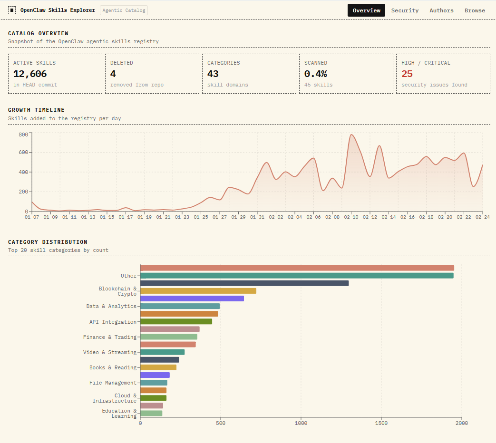
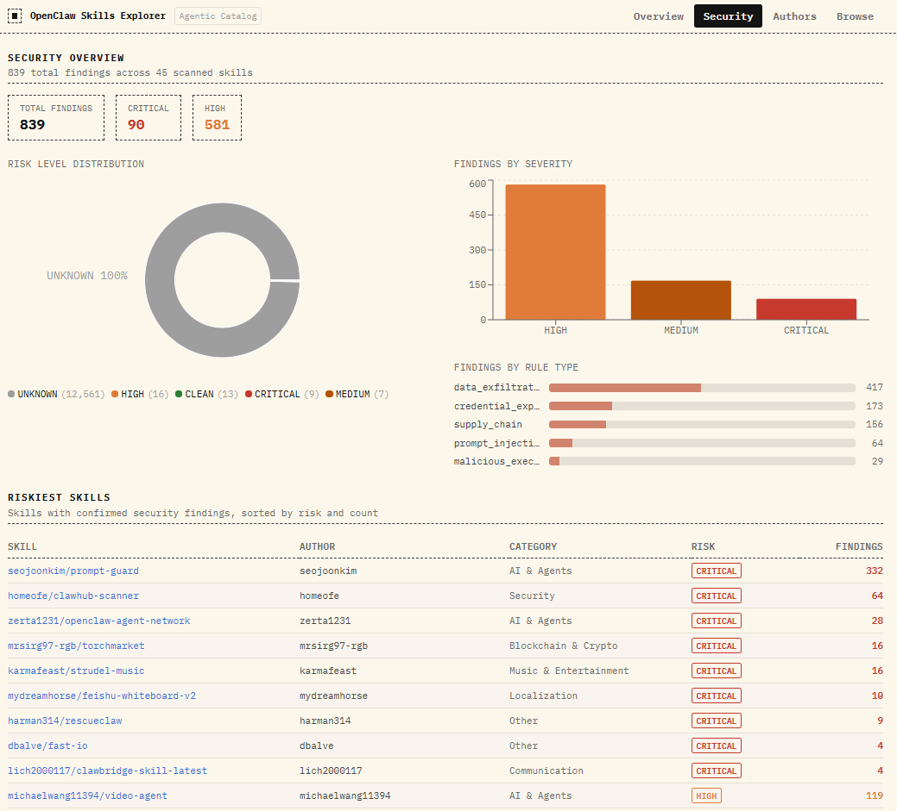
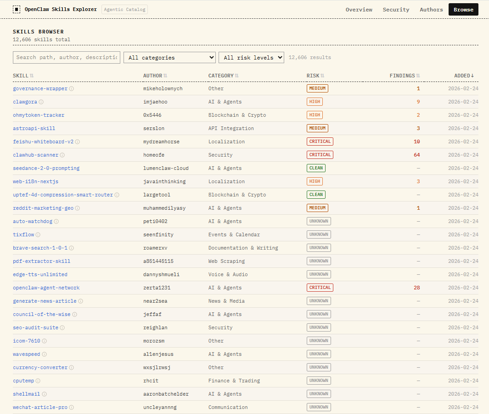

# openclaw-skills-explorer

A catalog builder and analytics dashboard for the [OpenClaw](https://github.com/openclaw/skills) agentic skills registry.

---

## Screenshots

### Overview — KPI metrics, growth timeline & category breakdown


### Security — risk distribution, findings by severity & riskiest skills


### Browse — searchable, filterable, paginated skill catalog


---

## What it does

The OpenClaw skills repository contains hundreds of community-contributed agent skills, each living in its own folder with a `SKILL.md` file. This project gives you two things:

**`skills_catalog.py`** — a Python CLI that walks the git history of that repository, extracts metadata from every skill, runs a static security scan against each one, categorizes it, and stores everything in a local DuckDB file. On subsequent runs it only processes skills that changed since the last commit, so repeat syncs are fast. The final step exports two Parquet files that the dashboard can consume.

**`skills-dashboard/`** — a React application that loads those Parquet files directly in the browser using DuckDB WASM. There is no backend. Open the page, the files load, DuckDB runs a handful of analytical queries client-side, and you get a full picture of the registry: growth over time, category distribution, security risk breakdown, and a searchable/filterable table of every skill.

---

## Architecture

```
openclaw/skills  (git repo)
        |
        v
skills_catalog.py
  - git log delta since last run
  - parse SKILL.md metadata
  - security scan (regex rules)
  - categorize by keyword scoring
  - blacklist filter
        |
        v
skills_catalog.duckdb    (local, not committed)
        |
        v
  skills.parquet          ->  skills-dashboard/public/
  findings.parquet        ->  skills-dashboard/public/
        |
        v
skills-dashboard  (Vite + React + DuckDB WASM)
  - runs entirely in the browser
  - no server required after build
```

---

## Repository layout

```
openclaw-skills-explorer/
  skills_catalog.py          # catalog builder CLI
  blacklist.yaml             # block skills by author, category, or keyword
  pyproject.toml             # Python dependencies (uv)

  skills-dashboard/
    public/
      skills.parquet         # generated by catalog builder
      findings.parquet       # generated by catalog builder
    src/
      hooks/useSkillsData.js # DuckDB WASM queries
      sections/              # Overview, Security, Authors, Browse tabs
      components/            # shared UI primitives
```

---

## Catalog builder

### Prerequisites

- Python 3.12+
- [uv](https://docs.astral.sh/uv/) (or install deps manually with pip)
- A local clone of the OpenClaw skills repository

### Install dependencies

```bash
uv sync
```

### Run

```bash
# Incremental sync (recommended — only processes changed skills)
uv run skills_catalog.py --repo-path /path/to/openclaw/skills

# Specify a different DB path and export location
uv run skills_catalog.py \
  --repo-path /path/to/openclaw/skills \
  --db ./catalog.duckdb \
  --export-dir ./skills-dashboard/public

# Force a full rescan of all skills (ignores last-commit checkpoint)
uv run skills_catalog.py --repo-path /path/to/openclaw/skills --full-rescan

# Print catalog statistics without running a sync
uv run skills_catalog.py --repo-path /path/to/openclaw/skills --stats

# Skip security scanning (faster, metadata only)
uv run skills_catalog.py --repo-path /path/to/openclaw/skills --no-scan
```

### CLI flags

| Flag | Default | Description |
|---|---|---|
| `--repo-path` | `/skills` | Path to the OpenClaw skills git repo |
| `--db` | `/workspaces/.../skills_catalog.duckdb` | DuckDB catalog file |
| `--blacklist` | `/workspaces/.../blacklist.yaml` | Blacklist configuration |
| `--export-dir` | `skills-dashboard/public` | Where to write the Parquet files |
| `--full-rescan` | off | Re-scan every skill, ignoring the last-commit checkpoint |
| `--no-scan` | off | Skip security scanning |
| `--stats` | off | Print stats and exit without syncing |

### Output

Each run produces or updates two files in `--export-dir`:

- `skills.parquet` — one row per skill with metadata, category, risk level, and blacklist flag
- `findings.parquet` — one row per security finding with rule ID, severity, file, line, and evidence

---

## Blacklist configuration

`blacklist.yaml` controls which skills are suppressed in the catalog. Blacklisted skills are kept in the database with `is_blacklisted = true` rather than deleted, so the history is preserved.

```yaml
# Block all skills from these authors (exact match, case-insensitive)
authors:
  - spammy-author

# Block all skills that fall into these categories
categories:
  - Gaming

# Block skills whose name or description contains any of these substrings
keywords:
  - phishing
  - steal credentials
```

---

## Security scanner

The catalog builder scans every file in a skill directory against a set of regex rules grouped into five categories. Rules fire per-line and deduplicate by `(rule_id, file, line)`.

| Category | Rule IDs | What it looks for |
|---|---|---|
| Prompt Injection | PI-001 – PI-004 | Instruction overrides, safety bypasses, role manipulation, hidden Unicode |
| Credential Exposure | CRED-001 – CRED-003 | Hardcoded API keys/tokens, credentials passed through LLM context, env var harvesting |
| Data Exfiltration | EXFIL-001 – EXFIL-003 | Silent outbound requests, HTTP calls to external hosts, webhook/callback URLs |
| Malicious Execution | EXEC-001 – EXEC-003 | Shell injection patterns, dynamic code evaluation, reverse shell indicators |
| Supply Chain | SC-001 – SC-002 | Dependency confusion patterns, unvetted install commands |

Severity levels in descending order: `CRITICAL` > `HIGH` > `MEDIUM` > `LOW` > `INFO`. A skill's overall risk level is the highest severity of any finding against it. Skills with no findings are marked `CLEAN`.

---

## Dashboard

### Prerequisites

- Node.js 18+

### Development

```bash
cd skills-dashboard
npm install
npm run dev
```

The dev server expects `skills.parquet` and `findings.parquet` to exist at `public/skills.parquet` and `public/findings.parquet`. Run the catalog builder first to generate them, or copy them from a previous run.

### Production build

```bash
npm run build
```

The output in `dist/` is a fully static site. Drop it behind any static file host (nginx, S3, Cloudflare Pages, etc.). The only runtime dependency is the browser — DuckDB WASM is bundled via `duckdb-wasm-kit`.

### Tabs

| Tab | Content |
|---|---|
| Overview | KPI strip, daily growth timeline, category distribution |
| Security | Risk level distribution, findings by severity and rule type, riskiest skills table |
| Authors | Top contributors by skill count |
| Browse | Full paginated/sortable/filterable table of all skills with per-skill findings modal |

---

## Stack

| Layer | Technology |
|---|---|
| Catalog builder | Python 3.12, DuckDB, pandas, PyYAML |
| Data format | Apache Parquet |
| Dashboard | React 19, Vite, Tailwind CSS v4, Recharts |
| In-browser query engine | DuckDB WASM (`duckdb-wasm-kit`) |
